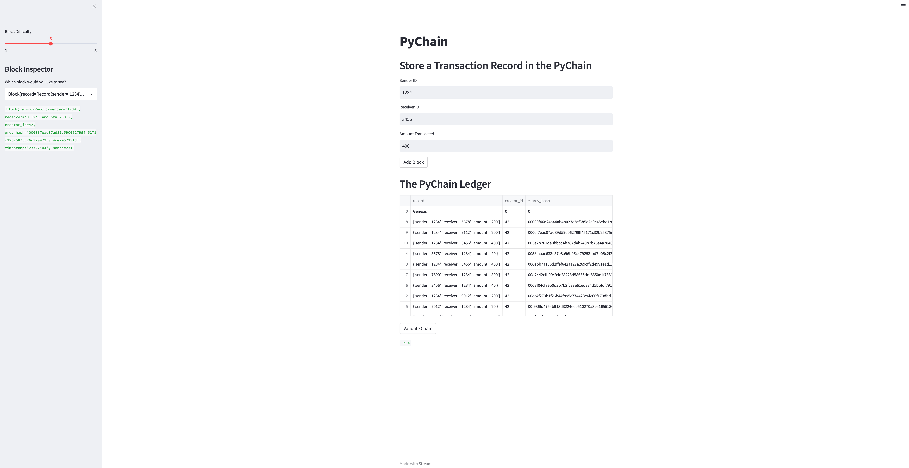
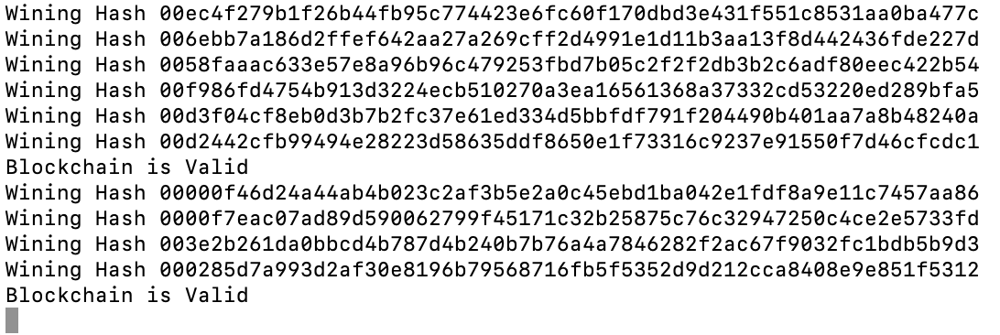

# PyChain_Ledger

## This project consisted of making edits to an existing pychain file in order to optimize Streamlit integration

* Dummy transactions were created to view the functionality of the blockchain and the Streamlit user interface. Provided is an image of the fully functioning Streamlit web page, consisting of several mined blocks on the PyChain Ledger, a True value for the blockchain validation process, block number 9 in the Block Inspector, and the block difficulty sliding scale.

* Bellow is a screenshot of the entire PyChain ledger (created with dummy transactions for testing purposes)

* Every time a block is successfully mined or the blockchain is validated a confirmation message is displayed in the terminal, as seen below
